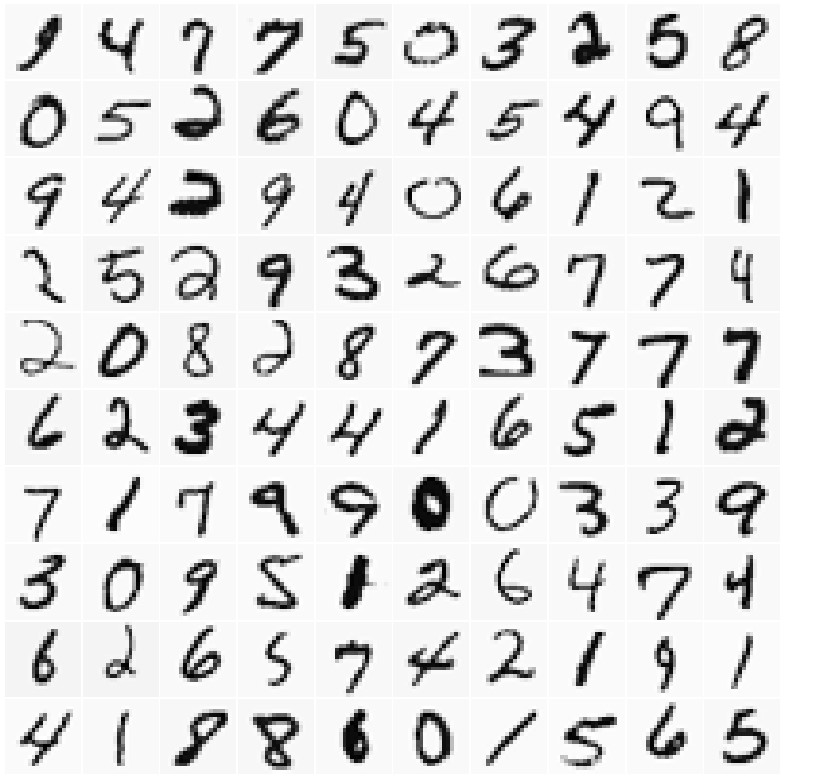
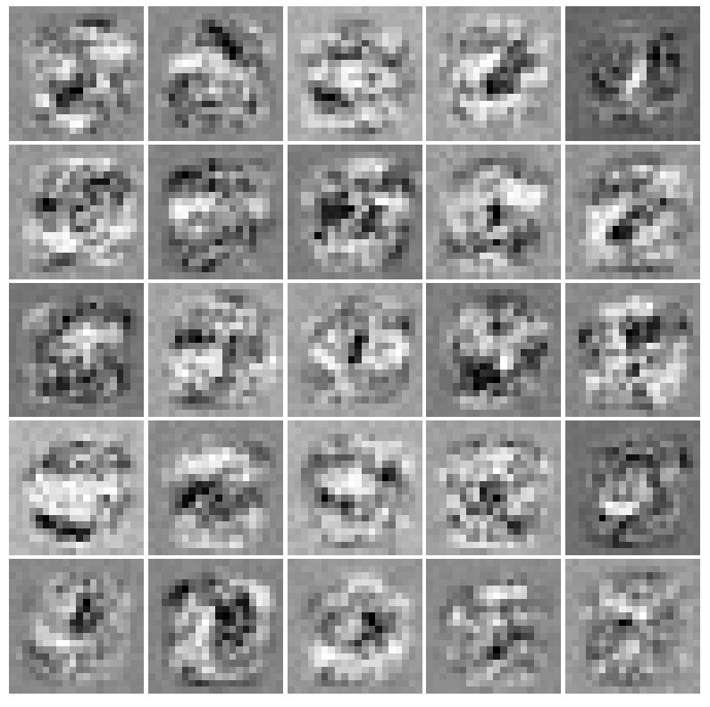

### Creating a Neural Network from Scratch

The dataset used to create the neural network consists of **images with dimensions of 20 x 20 pixels**. 

Each pixel represents an attribute of the image in the dataset, resulting in a final dataset with **400 attributes**. 

**Pixel values range from 0 to 255**. 

**The output attribute** represents the **class labels corresponding to the digits 0 through 9** based on the input image.

The task of the neural network is **to predict which class a given input belongs to**.

### Visualization of Input Data:

### Neural Network Architecture:

The neural network has an **input layer of 400 neurons (20x20 px)**, each neuron having values ranging from 0 to 255.
The **hidden layer** consists of **25 neurons**.
The **output layer** represents **10 labels**.

The activation function used by the neural network is the **sigmoid function**.

The **cost function** with added **regularization** has been defined, and gradients have been computed for each theta parameter.

Optimization was performed over **100 iterations**.

### Visualization of the Hidden Layer:

